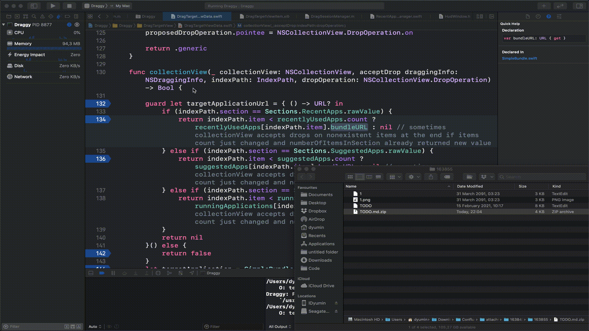
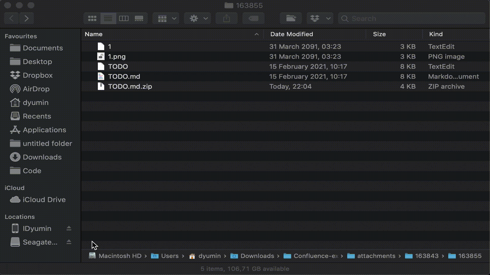

# Draggy

Do you drag? Do you drag a lot? Tired of dragging all the way through your screen real estate?
Tell us no more! We got you!



Draggy remembers apps used to open particular file extension and will suggest them next time you drag file with same type even if these is no extension is the filename!


Draggy supports youtube videos download. Just drag any url containing ```*youtube.com/watch?v=*``` and drop it on draggy\`s download icon.
Note: in order to get the best possible quality make sure ffmpeg is available at ```/usr/local/bin/ffmpeg``` (```brew install ffmpeg```)

Send ~~nudes~~ feature requests!
